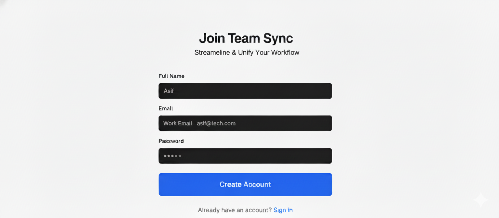
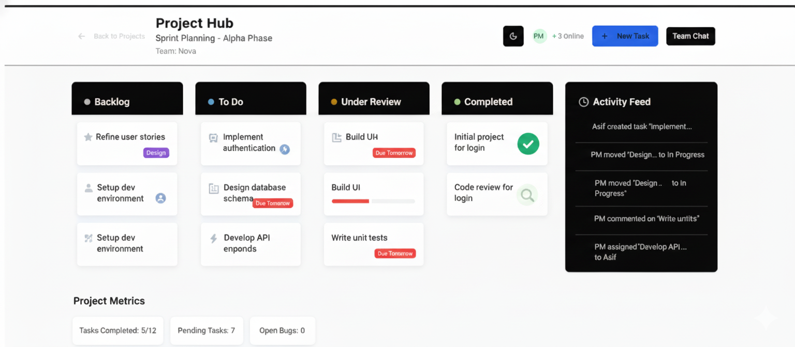
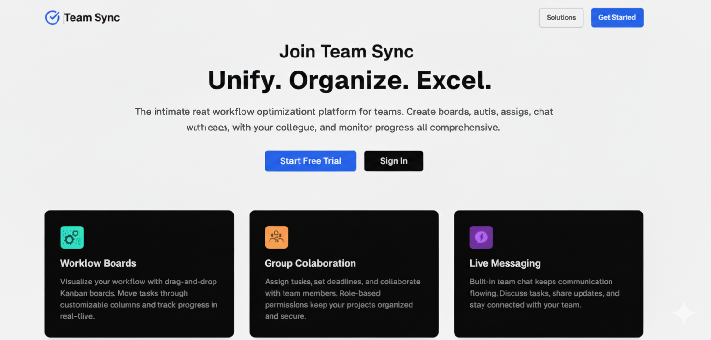
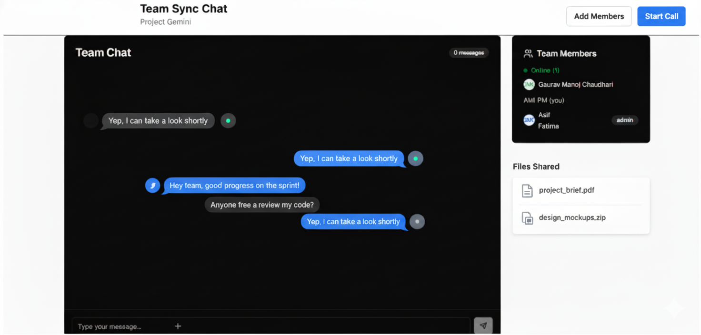

TeamFlow - Collaborative Workspace

## 🚀 Project Overview
- TeamFlow is a modern collaborative platform designed for teams to manage projects, track tasks, and communicate in real-time. Built with cutting-edge technology, it provides seamless collaboration experience with intuitive interfaces and powerful features.

## ✨ Key Features
- 🔄 Live Collaboration - Real-time updates and synchronization

- 📋 Smart Task Management - Drag-and-drop interface with customizable workflows

- 👥 Team Workspaces - Dedicated spaces for different projects and teams

- 🔔 Smart Notifications - Stay updated with task changes and team activities

- 💬 Integrated Messaging - Built-in chat for seamless communication

- 📈 Progress Analytics - Visual insights into team productivity and project progress

## 🛠️ Technology Stack
- Frontend: Next.js 14, React, TypeScript, Tailwind CSS

- Styling: Custom UI components with modern design system

- State Management: React Context & Custom Hooks

- Real-time Communication: WebSocket integration

- Database: Supabase (PostgreSQL)

- Authentication: Secure session management

## 🏗️ Project Structure

- text

## TeamFlow-Workspace
- app/                 # Next.js app router pages
- components/          # Reusable UI components
- lib/                 # Utilities and configurations
- hooks/               # Custom React hooks
- public/              # Static assets
- styles/              # Global styles and themes

## ⚡ Quick Start
Prerequisites:
- Node.js 18+
- npm or yarn

## Installation
# Clone the repository
git clone <your-repository-link>
cd TeamSync-Workspace

# Install dependencies
npm install

# Start development server
npm run dev

## Environment Setup
Create a .env.local file with:

env
- NEXT_PUBLIC_SUPABASE_URL=your_supabase_url
- NEXT_PUBLIC_SUPABASE_ANON_KEY=your_supabase_key

## 🎯 Usage
1- Create your workspace - Set up your team environment

2- Invite team members - Collaborate with your team

3- Create projects - Organize tasks and milestones

4- Track progress - Monitor team productivity in real-time

## 🔧 Configuration Files
- styling-config.ts - Tailwind CSS configuration
- session-manager.ts - Authentication middleware
- theme-config.json - UI component theming
- css-processor.mjs - PostCSS configuration

## 🖼️ Project Demonstration

## 🚀 Deployment
# Build for production
npm run build

# Start production server
npm start

## 📝 Development
# Run in development mode
npm run dev

# Run tests
npm test

# Build project
npm run build

## 🤝 Contributing
- Fork the repository
- Create your feature branch
- Commit your changes
- Push to the branch
- Open a Pull Request

## 📄 License
This project is licensed under the MIT License.

👨‍💻 Developer
Saajid - Full Stack Developer

TeamFlow - Streamlining team collaboration, one task at a time. 🚀
            <!-- TeamFlow Project - Saajid -->